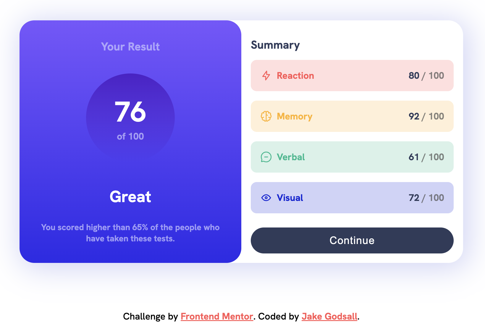

# Frontend Mentor - Results summary component solution

This is a solution to the [Results summary component challenge on Frontend Mentor](https://www.frontendmentor.io/challenges/results-summary-component-CE_K6s0maV). Frontend Mentor challenges help you improve your coding skills by building realistic projects. 

## Table of contents

- [Frontend Mentor - Results summary component solution](#frontend-mentor---results-summary-component-solution)
  - [Table of contents](#table-of-contents)
  - [Overview](#overview)
    - [The challenge](#the-challenge)
    - [Screenshot](#screenshot)
    - [Links](#links)
  - [My process](#my-process)
    - [Built with](#built-with)
    - [What I learned](#what-i-learned)
  - [Author](#author)

## Overview

### The challenge

Users should be able to:

&#9745; View the optimal layout for the interface depending on their device's screen size

&#9745; See hover and focus states for all interactive elements on the page

### Screenshot

### Links

- Live Site URL: [Netlify](https://jakegodsall-results-summary.netlify.app/)

## My process

### Built with

- HTML5
- CSS3

### What I learned

For some time I have been focusing solely on frontend development using frameworks such as `React.js`, `Next.js`, `TailwindCSS`, etc.

I decided to take on this simpler project as a way to refreshen my skills using standard HTML and CSS.

## Author

-   Website - [Jake Godsall](https://jakegodsall.com)
-   Frontend Mentor - [@jakegodsall](https://www.frontendmentor.io/profile/jakegodsall)
-   LinkedIn - [@godsalljake](https://www.linkedin.com/in/godsalljake/)